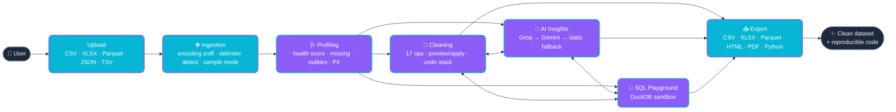

<!-- ──────────────────────────────────────────────────────────────────────────
     DataVaidya — README
     Aesthetic: deep navy #0F172A · violet #8B5CF6 · cyan #06B6D4
     ────────────────────────────────────────────────────────────────────────── -->

<a href="#-datavaidya">
  
</a>

<h1 align="center" id="-datavaidya">🧪 DataVaidya</h1>

<p align="center">
  <a href="https://datavaidya.streamlit.app">
    
  </a>
</p>

<p align="center"><strong>The data-quality engine your CSVs deserve. Free, fast, dark-mode, and shipped from India 🇮🇳.</strong></p>

<!-- ─── Row 1 of badges: stack ─────────────────────────────────────────── -->
<p align="center">
  
  
  
  
  
</p>

<!-- ─── Row 2 of badges: meta ─────────────────────────────────────────── -->
<p align="center">
  
  
  
  
  
  
</p>

<p align="center">
  <a href="https://datavaidya.streamlit.app">
    
  </a>
</p>

<p align="center"><em>Drag a CSV, get a clean dataset and an AI-generated executive summary — under 60 seconds, in your browser. No install, no sign-up, no credit card.</em></p>

---

## 🧠 Why DataVaidya?

Every analyst knows the dirty secret: **the first 60% of any project isn't analysis. It's babysitting bad data.** Excel coerces your phone numbers to scientific notation. Five different teams typed "Mumbai", "mumbai", "MUMBAI", and "Bombay" into the same column. Half your CSVs are CP-1252-encoded land mines. Aadhaar numbers are leaking into shared notebooks. And someone — *somewhere* — still uses `pandas-profiling` in 2026.

DataVaidya fixes the whole loop in one browser tab.

- 📤 **Drop a file.** CSV, TSV, Excel, Parquet, JSON — up to 50 MB.
- 🩺 **See a health score.** 0–100, with a precise breakdown of *why*.
- 🧹 **Toggle fixes & preview the diff** before committing. Undo / redo, snapshots, the works.
- 🤖 **Ask the AI** for an executive summary. Groq primary, Gemini fallback, PII scrubbed before send.
- 📥 **Export everything.** Clean CSV, Excel, Parquet — *plus* a reproducible Python script you can run on the full dataset locally.

> Built specifically for Indian data: PAN, Aadhaar, GSTIN, IFSC, +91 mobiles, INR strings, and DD-MM-YYYY dates are first-class citizens.

---

## ✨ Feature Bento

|  |  |  |
|---|---|---|
| **📊 Health Score**<br/>0–100 weighted across 8 dimensions: missing, dupes, outliers, imbalance, mixed dtypes, cardinality, constants, date drift. | **🇮🇳 Indian PII Detection**<br/>Regex + Verhoeff/Luhn checks for PAN, Aadhaar, GSTIN, IFSC, mobile, pincode, credit cards. Mask with Faker `en_IN`. | **🧹 17 Cleaning Ops**<br/>Fill/drop/cap/strip/case/dates/types/clip/normalize/zscore/filter. Preview before apply. Snapshot stack. |
| **🤖 LLM Insights**<br/>Groq `llama-3.3-70b-versatile` → Gemini `2.5-flash` fallback. 5-call cap. PII scrubbed pre-send. Streamed live. | **🦆 SQL Playground**<br/>DuckDB in-memory, sandboxed (`ATTACH`/`COPY`/`INSTALL` blocked + `enable_external_access=false`). Query history. | **🐍 Reproducible Code**<br/>Download a self-contained `.py` that replays every cleaning step on the full file. Pandas + stdlib only. |
| **📄 Multi-format Export**<br/>CSV (UTF-8 BOM), Excel (auto-fit columns), Parquet (snappy), PDF executive summary, HTML profile report. | **🛡️ Memory Guardrails**<br/>Live RSS monitor in sidebar. Auto-sample at 30 MB. Smart downcast suggestions. Fits Streamlit Cloud's 1 GB. | **🎨 Dark Mode UI**<br/>Linear/Vercel/Stripe aesthetic. Mesh-gradient hero, typewriter title, pulsing uploader, micro-interactions. |

---

## 🎬 Live Demo

<p align="center">
  <a href="https://datavaidya.streamlit.app">
    
  </a>
</p>

> *No install. No sign-up. No credit card. Drag a CSV, get answers.*
> Cold start ~30s on the free Streamlit tier — the spinner is part of the charm.

---

## 📸 Screenshots

> **Replace these placeholders with real captures. Exact dimensions below.**

<table>
<tr>
  <td align="center" width="50%">
    
    <br/><sub><strong>01 — Landing.</strong> Hero block, three quickstart cards, sidebar memory monitor. <code>780×440</code></sub>
  </td>
  <td align="center" width="50%">
    
    <br/><sub><strong>02 — Profile.</strong> Health gauge, 8-axis breakdown grid, missing/dupes/outliers tabs. <code>780×440</code></sub>
  </td>
</tr>
<tr>
  <td align="center">
    
    <br/><sub><strong>03 — Clean.</strong> Toggle ops left, preview/apply right, before/after metric cards. <code>780×440</code></sub>
  </td>
  <td align="center">
    
    <br/><sub><strong>04 — AI Insights.</strong> Streaming Groq summary, feedback buttons, PII notice. <code>780×440</code></sub>
  </td>
</tr>
<tr>
  <td align="center">
    
    <br/><sub><strong>05 — Export.</strong> Six formats, sanitized filenames, cleaning-log expander. <code>780×440</code></sub>
  </td>
  <td align="center">
    
    <br/><sub><strong>06 — PII Detector.</strong> PAN, Aadhaar, GSTIN highlighted with DPDP Act 2023 note. <code>780×440</code></sub>
  </td>
</tr>
</table>

> **Banner for the README header (top of file):** drop a `docs/banner.png` at **`1280×320`** if you want to replace the capsule-render header with a custom image.

---

## 🏛️ Architecture



---

## ⚔️ How it stacks up

| Capability | **DataVaidya** | ydata-profiling | Tableau Prep | Power BI Cleaning |
| --- | :---: | :---: | :---: | :---: |
| Free forever | ✅ | ✅ | ❌ ($75/mo) | ❌ (Pro license) |
| Browser-only, zero install | ✅ | ❌ | ❌ | ❌ |
| Dark mode (default) | ✅ | ❌ | ⚠️ Beta | ⚠️ Beta |
| AI-generated executive summaries | ✅ Groq + Gemini | ❌ | ⚠️ Einstein add-on | ⚠️ Copilot (paid) |
| Indian PII (PAN/Aadhaar/GSTIN/IFSC) | ✅ Native | ❌ | ❌ | ❌ |
| Reproducible code export | ✅ Python | ❌ HTML only | ❌ `.tflx` lock-in | ❌ `.pq` lock-in |
| Embedded SQL playground | ✅ DuckDB | ❌ | ⚠️ Calc fields | ⚠️ DAX |
| Health score (0–100) | ✅ 8-axis | ❌ | ❌ | ❌ |
| Cold-start to first chart | ⚡ <60s | 🐢 ~5min | 🐢 install | 🐢 install |
| Runs on 1 GB RAM | ✅ | ⚠️ Heavy | ❌ | ❌ |
| Indian context (INR, DD-MM-YYYY, IST) | ✅ | ❌ | ⚠️ Locale toggle | ⚠️ Locale toggle |

> ✅ first-class &nbsp;·&nbsp; ⚠️ partial / paid &nbsp;·&nbsp; ❌ not supported

---

## 🚀 Quickstart

```bash
# 1. Clone
git clone https://github.com/Anki1004/datavaidya.git
cd datavaidya

# 2. Install (Python 3.12)
python -m venv .venv
source .venv/bin/activate          # Windows: .venv\Scripts\activate
pip install -r requirements.txt

# 3. Set secrets (optional — only needed for AI Insights page)
cp .streamlit/secrets.toml.example .streamlit/secrets.toml
#  Edit secrets.toml and paste your keys:
#    GROQ_API_KEY   → https://console.groq.com/keys
#    GEMINI_API_KEY → https://aistudio.google.com/app/apikey

# 4. Generate demo datasets (Titanic, Iris, Census, Mumbai RE, Retail)
python make_demo.py

# 5. Run
streamlit run app.py
```

Open <http://localhost:8501> and you're in. **No keys required** to use Ingestion, Profiling, Cleaning, SQL, or Export — only the AI Insights page asks for them.

---

## ☁️ Deploy to Streamlit Community Cloud

```text
1. Push to GitHub                  →  git push origin main
2. share.streamlit.io              →  New app → pick repo + branch + app.py
3. Advanced settings               →  Python 3.12
4. Secrets editor                  →  paste GROQ_API_KEY (+ GEMINI_API_KEY)
5. Deploy                          →  https://<your-app>.streamlit.app  🎉
```

Total time: ~5 minutes. Subsequent `git push` redeploys automatically.

---

## 📂 Project Structure

```
datavaidya/
├── .streamlit/                    # theme + secrets template
├── app.py                         # thin entrypoint (hero + routing)
├── pages/                         # Streamlit multipage system
│   ├── 1_📊_Profile.py
│   ├── 2_🧹_Clean.py
│   ├── 3_🤖_AI_Insights.py
│   └── 4_📥_Export.py
├── core/                          # pure logic — no Streamlit imports
│   ├── ingestion.py               # readers + encoding/delimiter sniff
│   ├── profiling.py               # health score + 13 metrics
│   ├── cleaning.py                # 17 ops + undo + change log
│   ├── pii.py                     # Indian PII regex + Faker masking
│   ├── sql_engine.py              # DuckDB sandbox + safety
│   ├── llm.py                     # Groq → Gemini → fallback chain
│   └── exports.py                 # CSV / Excel / Parquet / HTML / PDF / .py
├── ui/                            # Streamlit-only widgets + theme
│   ├── theme.py                   # CSS injection + Plotly template
│   ├── components.py              # hero, cards, gauge, breakdown grid
│   ├── charts.py                  # 7 themed Plotly builders
│   └── onboarding.py
├── utils/
│   ├── constants.py               # single source of truth
│   ├── memory.py                  # psutil monitor + samplers
│   └── validation.py
├── data/samples/                  # 5 bundled demo datasets
├── tests/                         # pytest — 39 passing
├── make_demo.py                   # regenerate demo CSVs (seed=42)
├── requirements.txt
├── README.md
└── LICENSE
```

---

## 🛠️ Tech Stack

<p>
  
  
  
  
  
  
  
  
  
  
  
  
  
  
  
  
</p>

---

## 🗺️ Roadmap

### ✅ Shipped (v0.1)
- [x] 5-format ingestion with encoding/delimiter sniff
- [x] 8-axis health score (0–100) + Plotly gauge
- [x] 17 cleaning ops with preview/apply + undo
- [x] Indian PII detection (PAN, Aadhaar, GSTIN, IFSC, +91, pincode, cards)
- [x] PII-safe LLM context builder
- [x] Groq primary + Gemini fallback + static fallback
- [x] DuckDB sandbox with multi-statement & exfil guards
- [x] 6-format export (CSV/Excel/Parquet/HTML/PDF/Python)
- [x] Reproducible-code generator (`.py` replay)
- [x] Animated dark-mode UI (mesh hero, typewriter, card glow, uploader pulse)
- [x] 5 bundled demo datasets seeded with quality issues
- [x] 39 passing pytest cases

### 🔜 Queued (v0.2)
- [ ] Side-by-side **diff view** for cleaning preview
- [ ] **Google Sheets / Excel Online** live connectors
- [ ] **Polars** engine for >1M-row datasets
- [ ] **Hindi / Tamil / Bengali** UI localisation
- [ ] **Scheduled runs** with email digest (cron + SMTP)
- [ ] **Custom-validator plug-in API** (industry-specific rules)
- [ ] **Multi-file compare** (drift detection across uploads)
- [ ] **Looker Studio / Metabase** one-click handoff

### 💭 Maybe (v1.0+)
- [ ] Realtime collaboration (shared sessions, cursors, comments)
- [ ] Self-hosted Docker image with bundled LLM (Ollama)
- [ ] Power BI / Tableau **export-as-plugin** pipeline
- [ ] Mobile-first responsive layout

> Have an idea? [Open an issue](https://github.com/Anki1004/datavaidya/issues/new?template=feature_request.md) — we read every one.

---

## 🤝 Contributing

We love PRs, especially for:

- 🇮🇳 **More Indian PII validators** (Voter ID, Passport, Driving License, EPF UAN…)
- 📅 **Regional date / currency parsers** (RBI ₹ lakh-crore, fiscal-year offsets)
- 🧪 **Edge-case datasets** that break our profiler — break us and we'll fix it
- 🎨 **Theme variants** (light mode, high-contrast, AMOLED-black)
- 📚 **Docs** in Indian languages

**Workflow** — short and friendly:

```bash
# 1. Fork & clone
git clone https://github.com/your-fork/datavaidya.git
cd datavaidya

# 2. Branch
git checkout -b feat/your-idea

# 3. Dev setup
pip install -r requirements.txt
pip install pytest ruff mypy        # dev extras

# 4. Make changes, then verify
pytest -q
ruff check .
mypy --strict core utils

# 5. Push & open a PR
```

For non-trivial changes, please open an [issue](https://github.com/Anki1004/datavaidya/issues) first so we can align before you spend a weekend on it. See [CONTRIBUTING.md](./CONTRIBUTING.md) for the full guide.

---

## 📜 License

[MIT](./LICENSE) © 2026 DataVaidya Contributors.

Do what you want, just keep the notice. No warranty, no babysitting, no telemetry phoning home.

---

## 🙏 Acknowledgements

- [Streamlit](https://streamlit.io) — for making this possible in a single Python file
- [Groq](https://groq.com) — for free, fast inference that makes the AI page feel instant
- [DuckDB](https://duckdb.org) — for embedded SQL that just works
- [ydata-profiling](https://github.com/ydataai/ydata-profiling) — for setting the bar on auto-profiling
- The **Indian analytics community** — every analyst who's ever cursed at `low_memory=False`

---

<p align="center">
  <sub>Built with ❤️ in <strong>India 🇮🇳</strong> · Designed in dark mode · Tested on 1 GB RAM · Approved by tea drinkers ☕</sub>
</p>

<p align="center">
  <a href="#-datavaidya">⬆ Back to top</a>
</p>


